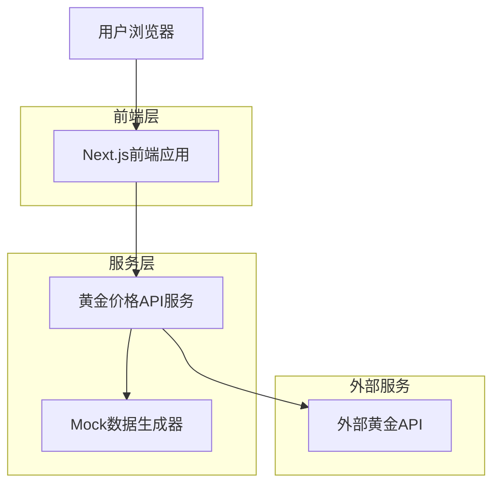

## 1. 架构设计



## 2. 技术描述

- **前端**: Next.js@14 + React@18 + TypeScript@5 + Tailwind CSS@3
- **初始化工具**: create-next-app
- **后端**: 无独立后端，使用Next.js API Routes处理数据获取
- **数据库**: 无数据库，使用内存缓存和API直接获取
- **图表库**: TradingView Lightweight Charts 或 Chart.js
- **状态管理**: React Context + SWR 进行数据获取和缓存
- **UI组件**: Headless UI + 自定义组件

## 3. 路由定义

| 路由 | 用途 |
|-------|---------|
| / | 首页，展示实时价格和24小时趋势 |
| /details/[symbol] | 价格详情页，展示具体品种的详细信息和历史趋势 |
| /analysis | 市场分析页面，展示专家观点和新闻资讯 |
| /api/prices | API路由，获取实时价格数据 |
| /api/history | API路由，获取历史价格数据 |

## 4. API定义

### 4.1 价格数据API

```
GET /api/prices
```

响应参数：
| 参数名称 | 参数类型 | 描述 |
|-----------|-------------|-------------|
| symbol | string | 品种代码 (如: GOLD, SILVER) |
| price | number | 当前价格 (人民币/克) |
| change | number | 价格变化 |
| changePercent | number | 变化百分比 |
| timestamp | number | 时间戳 |

示例响应：
```json
{
  "GOLD": {
    "symbol": "GOLD",
    "price": 485.50,
    "change": 2.30,
    "changePercent": 0.48,
    "timestamp": 1704081600000
  },
  "SILVER": {
    "symbol": "SILVER", 
    "price": 5.82,
    "change": -0.05,
    "changePercent": -0.85,
    "timestamp": 1704081600000
  }
}
```

### 4.2 历史数据API

```
GET /api/history?symbol=GOLD&period=24h
```

请求参数：
| 参数名称 | 参数类型 | 必需 | 描述 |
|-----------|-------------|-------------|-------------|
| symbol | string | 是 | 品种代码 |
| period | string | 是 | 时间周期 (24h, 7d, 30d, 90d) |

响应参数：
| 参数名称 | 参数类型 | 描述 |
|-----------|-------------|-------------|
| data | array | 历史价格数据数组 |
| timestamp | number | 时间戳 |
| open | number | 开盘价 |
| high | number | 最高价 |
| low | number | 最低价 |
| close | number | 收盘价 |
| volume | number | 成交量 |

## 5. 数据获取策略

### 5.1 Mock数据生成器
- 使用Node.js编写数据生成服务
- 模拟真实黄金价格波动，基于随机游走算法
- 每5秒生成新的价格数据
- 支持多个品种 (黄金、白银、铂金)

### 5.2 外部API集成
- 集成免费黄金价格API (如: Metals-API, GoldAPI)
- 实现API降级策略，外部API不可用时自动切换到Mock数据
- 添加数据缓存机制，减少API调用次数

## 6. 性能优化

### 6.1 前端优化
- 使用Next.js ISR (Incremental Static Regeneration) 对静态内容进行优化
- 实现虚拟滚动对长列表数据进行优化
- 使用React.memo和useMemo减少不必要的重新渲染
- 图片使用Next.js Image组件进行自动优化

### 6.2 数据获取优化
- 使用SWR进行数据获取，内置缓存和重试机制
- 实现请求去重，避免重复请求相同数据
- 使用WebSocket实现真正的实时数据推送 (可选)

## 7. 部署配置

### 7.1 环境变量
```
# API配置
NEXT_PUBLIC_API_URL=https://huangjin.xin
GOLD_API_KEY=your_api_key_here
GOLD_API_URL=https://api.metals-api.com

# 功能开关
NEXT_PUBLIC_ENABLE_MOCK_DATA=true
NEXT_PUBLIC_UPDATE_INTERVAL=5000
```

### 7.2 构建配置
- 使用Vercel进行部署，支持自动CI/CD
- 配置自定义域名 huangjin.xin
- 启用HTTPS和HTTP/2
- 配置CDN加速静态资源访问