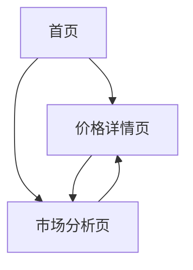

## 1. 产品概述
实时黄金价格展示网站，专为中文用户设计。通过域名 huangjin.xin 为投资者和消费者提供准确的黄金价格信息，帮助用户及时了解市场动态，做出明智的投资决策。

## 2. 核心功能

### 2.1 用户角色
本网站为纯展示型网站，不设用户登录/注册功能。所有访问者均可查看全部内容。

### 2.2 功能模块
网站主要包含以下页面：
1. **首页**: 实时价格展示、24小时趋势图、主要品种价格对比
2. **价格详情页**: 详细价格信息、历史趋势图表、技术分析
3. **市场分析页**: 专家观点、市场新闻、价格预测

### 2.3 页面详情
| 页面名称 | 模块名称 | 功能描述 |
|-----------|-------------|-------------|
| 首页 | 实时价格展示 | 显示人民币/克价格，每5秒自动更新，包含买入价和卖出价 |
| 首页 | 24小时趋势图 | 展示过去24小时价格变化曲线，支持缩放和悬停查看具体价格 |
| 首页 | 主要品种对比 | 展示黄金、白银、铂金等主要贵金属价格对比 |
| 价格详情页 | 详细价格信息 | 显示开盘价、最高价、最低价、成交量等详细数据 |
| 价格详情页 | 历史趋势图表 | 提供7天、30天、90天不同时间周期的价格走势图 |
| 价格详情页 | 技术分析 | 显示移动平均线、支撑位、阻力位等技术指标 |
| 市场分析页 | 专家观点 | 展示行业专家对黄金市场的分析和预测 |
| 市场分析页 | 市场新闻 | 实时推送影响黄金价格的重要新闻资讯 |
| 市场分析页 | 价格预测 | 基于数据分析提供短期价格走势预测 |

## 3. 核心流程
用户访问网站的主要操作流程：
1. 用户访问首页 → 查看实时黄金价格 → 查看24小时趋势图 → 了解市场概况
2. 用户点击详情 → 查看详细价格信息 → 分析历史趋势 → 阅读技术分析
3. 用户浏览市场分析 → 阅读专家观点 → 查看最新资讯 → 参考价格预测

## 4. 用户界面设计

### 4.1 设计风格
- **主色调**: 深红色 (#DC2626) 和金色 (#F59E0B)，体现中国金融市场的专业性和黄金的贵重感
- **按钮样式**: 圆角矩形设计，主要按钮使用渐变金色背景
- **字体**: 优先使用系统默认中文字体，标题使用思源黑体，正文字体大小16px
- **布局风格**: 卡片式布局，顶部导航栏，主要内容居中显示
- **图标风格**: 使用简洁的线性图标，重点数据配以金色强调

### 4.2 页面设计概览
| 页面名称 | 模块名称 | UI元素 |
|-----------|-------------|-------------|
| 首页 | 实时价格展示 | 大号字体显示当前价格，红色表示上涨，绿色表示下跌，包含涨跌幅百分比 |
| 首页 | 24小时趋势图 | 使用TradingView风格图表，深色背景，金色价格线，支持鼠标悬停 |
| 首页 | 主要品种对比 | 网格布局展示各品种价格，使用卡片式设计，突出显示涨跌幅 |
| 价格详情页 | 详细价格信息 | 表格形式展示各项数据，使用对比色突出重要数据 |
| 价格详情页 | 历史趋势图表 | 全屏宽度图表，支持时间周期切换，包含成交量柱状图 |
| 市场分析页 | 专家观点 | 博客风格布局，包含作者头像、发布时间和阅读时长 |

### 4.3 响应式设计
- **桌面优先**: 默认设计为桌面端，最大宽度1200px
- **移动端适配**: 使用媒体查询适配手机屏幕，重要信息优先显示
- **触摸优化**: 按钮和交互元素最小点击区域为44px，支持滑动切换图表

### 4.4 数据可视化指导
- **图表类型**: 主要使用K线图和折线图展示价格趋势
- **颜色规范**: 上涨使用红色(#DC2626)，下跌使用绿色(#10B981)，符合中国股市习惯
- **动画效果**: 价格更新时使用平滑过渡动画，图表加载使用渐变效果
- **数据密度**: 合理控制图表信息密度，确保重要数据一目了然
