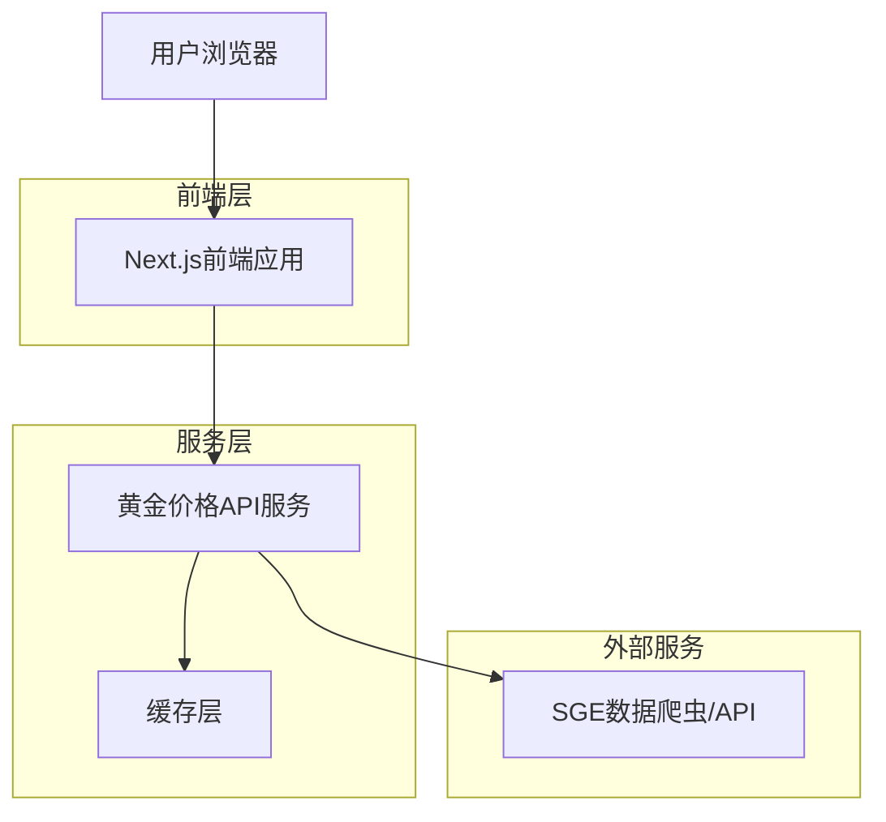

## 1. 架构设计



## 2. 技术描述

- **前端**: Next.js@14 + React@18 + TypeScript@5 + Tailwind CSS@3
- **初始化工具**: create-next-app
- **后端**: 无独立后端，使用Next.js API Routes处理数据获取
- **数据库**: 无数据库，使用内存缓存和API直接获取
- **图表库**: lightweight-charts@5
- **状态管理**: React Context + SWR 进行数据获取和缓存
- **UI组件**: Headless UI + 自定义组件

## 3. 路由定义

| 路由 | 用途 |
|-------|---------|
| / | 首页，展示实时价格和24小时趋势 |
| /details/[symbol] | 价格详情页，展示具体品种的详细信息和历史趋势 |
| /about | 关于页面，展示网站信息和数据来源 |
| /api/prices | API路由，获取实时价格数据 |
| /api/history | API路由，获取历史价格数据 |

## 4. API定义

### 4.1 价格数据API

```
GET /api/prices
```

响应参数：
| 参数名称 | 参数类型 | 描述 |
|-----------|-------------|-------------|
| symbol | string | 品种代码 (如: GOLD, SILVER) |
| price | number | 当前价格 (人民币/克) |
| change | number | 价格变化 |
| changePercent | number | 变化百分比 |
| timestamp | number | 时间戳 |

示例响应：
```json
{
  "GOLD": {
    "symbol": "GOLD",
    "price": 485.50,
    "change": 2.30,
    "changePercent": 0.48,
    "timestamp": 1704081600000
  },
  "SILVER": {
    "symbol": "SILVER",
    "price": 5.82,
    "change": -0.05,
    "changePercent": -0.85,
    "timestamp": 1704081600000
  }
}
```

### 4.2 历史数据API

```
GET /api/history?symbol=GOLD&period=24h
```

请求参数：
| 参数名称 | 参数类型 | 必需 | 描述 |
|-----------|-------------|-------------|-------------|
| symbol | string | 是 | 品种代码 |
| period | string | 是 | 时间周期 (24h, 7d, 30d, 90d) |

响应参数：
| 参数名称 | 参数类型 | 描述 |
|-----------|-------------|-------------|
| data | array | 历史价格数据数组 |
| timestamp | number | 时间戳 |
| open | number | 开盘价 |
| high | number | 最高价 |
| low | number | 最低价 |
| close | number | 收盘价 |
| volume | number | 成交量 |

## 5. 数据获取策略

### 5.1 SGE数据源集成
- 从上海黄金交易所官网爬取实时价格数据
- 主要数据接口：SGE Benchmark (DayilyJzj / DayilyShsilverJzj)
- 获取历史数据：SGE Benchmark History
- 铂金数据：暂无直接基准图，作为占位符处理

### 5.2 缓存策略
- 实时价格：10分钟缓存（SGE每日更新两次）
- 历史数据：1小时缓存
- 使用内存缓存减少频繁请求，提升响应速度

### 5.3 部署限制
- 使用Vercel免费版部署，存在速率限制
- 实现请求频率控制，避免触发平台限制

## 6. 性能优化

### 6.1 前端优化
- 使用Next.js ISR (Incremental Static Regeneration) 对静态内容进行优化
- 实现虚拟滚动对长列表数据进行优化
- 使用React.memo和useMemo减少不必要的重新渲染
- 图片使用Next.js Image组件进行自动优化

### 6.2 数据获取优化
- 使用SWR进行数据获取，内置缓存和重试机制
- 实现请求去重，避免重复请求相同数据
- 使用WebSocket实现真正的实时数据推送 (可选)

## 7. 部署配置

### 7.1 容器化部署 (Docker)
项目支持标准的 Docker 容器化部署，采用多阶段构建（Multi-stage Build）以优化镜像体积。

**构建流程：**
1. **base**: 基础 Node.js Alpine 镜像
2. **deps**: 安装项目依赖
3. **builder**: 构建 Next.js 应用，启用 `output: "standalone"`
4. **runner**: 生产环境运行镜像，仅包含必要的 standalone 文件和静态资源

**Dockerfile 特性：**
- 基于 `node:18-alpine`，体积小且安全
- 非 root 用户运行 (nextjs)，提高安全性
- 利用 Next.js 的 Standalone 模式，大幅减少镜像体积

### 7.2 环境变量
```
# API配置
NEXT_PUBLIC_API_URL=https://huangjin.xin

# 缓存配置
CACHE_REALTIME_TTL=600000  # 实时价格缓存10分钟
CACHE_HISTORY_TTL=3600000  # 历史数据缓存1小时

# 功能开关
NEXT_PUBLIC_UPDATE_INTERVAL=600000  # 10分钟更新间隔
```

### 7.2 构建配置
- 使用Vercel进行部署，支持自动CI/CD
- 配置自定义域名 huangjin.xin
- 启用HTTPS和HTTP/2
- 配置CDN加速静态资源访问
